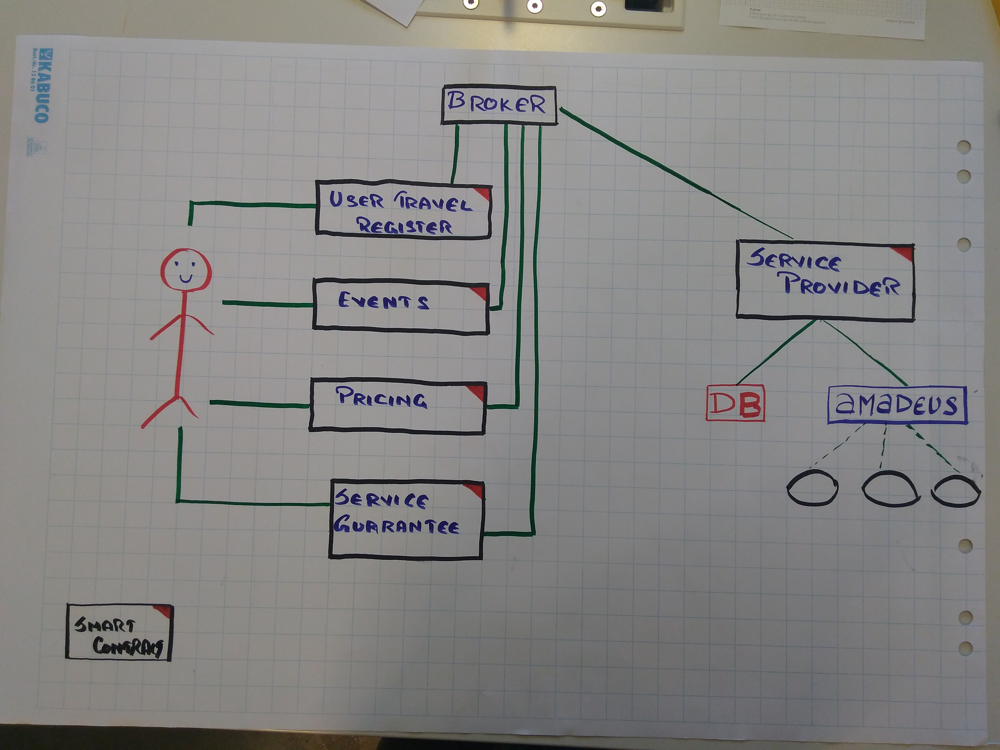
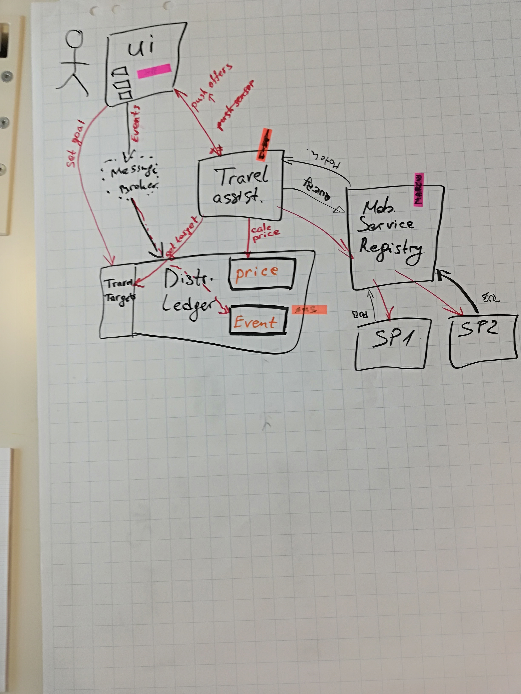
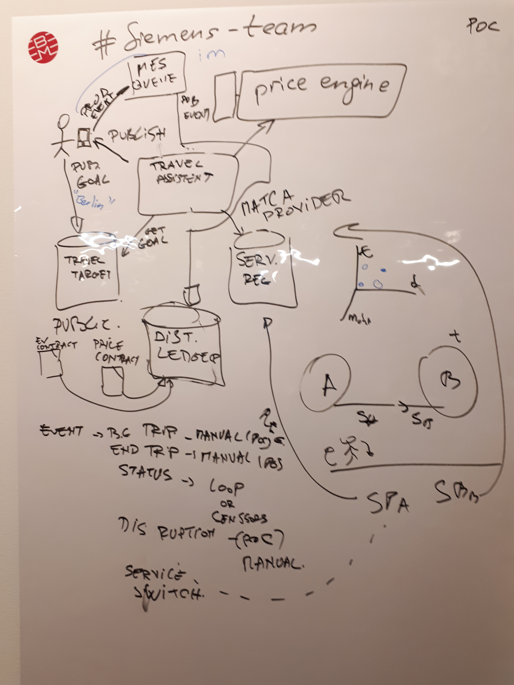
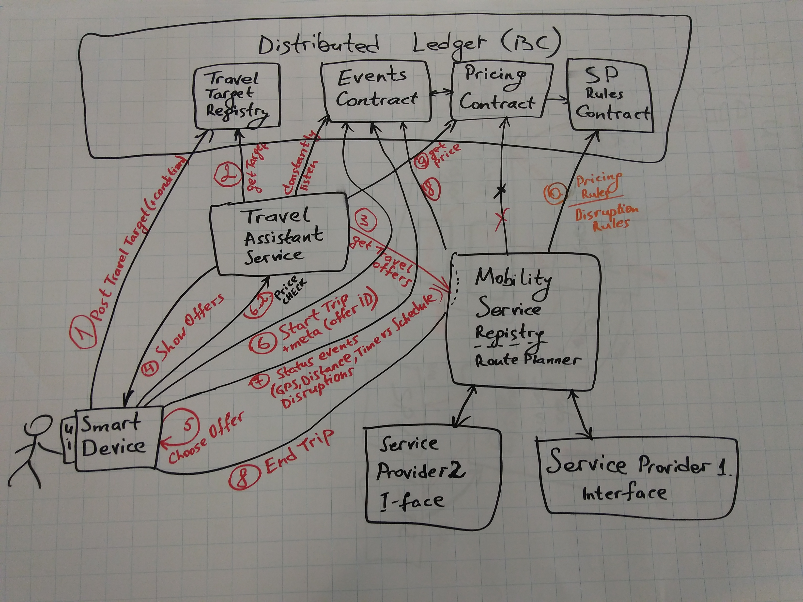
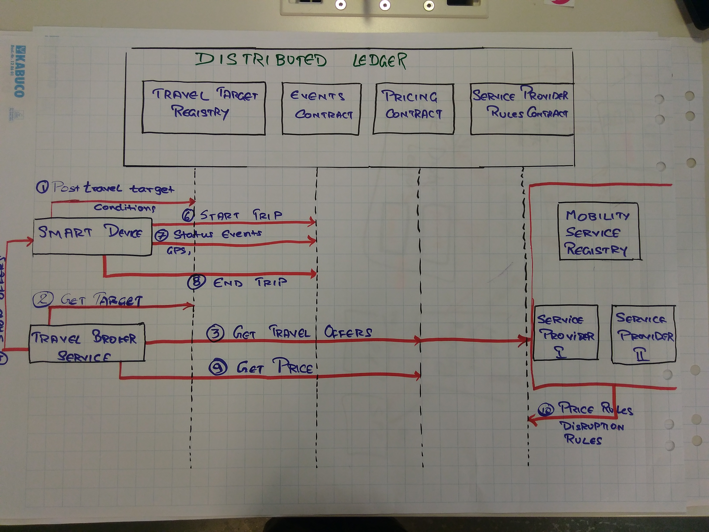
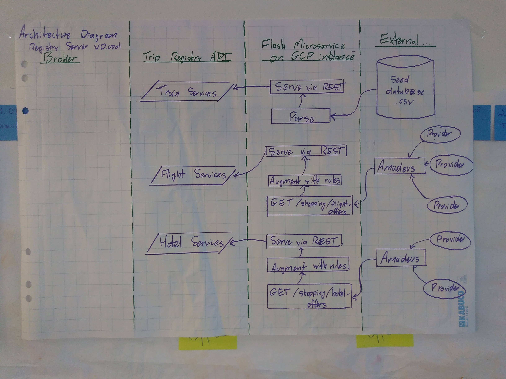
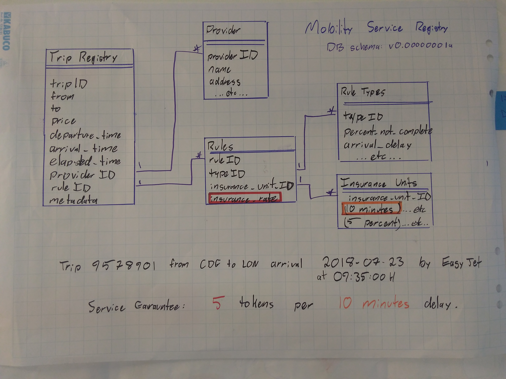

# **Power Trip**

*Satisfaction: Garaunteed on-chain*

Let's get into the D.E.T.A.I.L.S of our project; Power Trip!

```
D istributed
E vent based
T ravel
A nd
I n
L edger
S ervice
```

Have you ever been on the train and had a disruption? Just yesterday, I was sitting
in a full economy class car, and noticed the temperature climbing. Eventually, it got
so bad, they stopped the train and 'evacuated' 2 cars. In a full train, we now had to cram
into the remaining cars, standing around luggage, baby strollers, and unhappy co-travelers.

But I nonetheless paid full price, upfront, for this service. I consider this a breach of
contract, but I have no reasonable recourse. Maybe I spend some of my precious time to send
 a letter, and *maybe* they refund me?

Enter the world of **Garaunteed Travel**, where you pay for only and exactly the service you
agreed to. Automatically, without even thinking, the **broker** service will **enforce** the
contract you signed up for. Your money is held in **escrow**, and only disbursed to the
service provider upon exucution of the promised service.

---

Did the train only make it 70% of the way before being cancelled? Well, the service provider only get 70% of the funds!

---

Did the temperature exceed 26C for half of your 1st class trip? The service provider has access to only 75% of the paid fee!

---

**The power is in your hands!**

## Software components

The main component is the **Travel Broker Service** (TBS). The broker queries the **Mobility Service Server (MBS)** on behalf of the **customer**. The MBS presents a list of all valid **trips**, including the start and destination, price, times, and most importantly the **service garauntee rules**.

After selection of a service by the customer, the TBS establishes a back-to-back Smart Contract (SC) structure. SC1 is between the customer and TBS. SC1 includes a garauntee of service in terms of, for example;
* Cash back if delayed
* Cash back if comfort level not provided (temperature exceeded)
* Cash back if seat not available
* Etc...

The second contract, SC2, is between the MBS and the Service Provider (SP). The TBS is free to negotiate any SC2 they wish. In fact, TBS may wish to not have any SC2, and instead take the liability themselves!

This places the TBS in the role of **both Travel Broker and Travel Insurance Broker**.

The smart contracts are enforced by customer and vehicle sensors, and provided by streaming IOT messages by i.e. Kafka.

SC1 could be triggered by i.e. `temperature > 26 for > 1000 timesteps`, or by `actual arrival time - promised arrival time > 30 minutes`.

### Smart contracts



### service garauntee rules

The TBS is free to establish garauntees for their customers according to market demand. Therefore, more players should incentivize better garauntees. Likewise, the TBS is incentivized to negotiate strong SC2 from Service Providers, and vice versa, service providers will be priced out of the market unless they can meet the customer demands.

#### Overall architecture, v1

#### Overall architecture, v2

#### Overall architecture, v3

#### Overall architecture, v4


## Service Providers

The Service Providers component comprises the Mobility Service Registry, a server which aggregates trips, and serves them from a database.

### Service provider architecture



### Service provider schema




#
